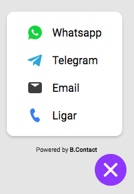

<h1 align="center">
    - Compartilhador de Contato
</h1>
<p align="center">Compartilhador de Contato que pode ser utilizado em qualquer site/sistema</p>

<h2 align="center"></h2>

## Sobre o projeto

O projeto tem como objetivo o desenvolvimento de um widget de contato que mostra os atalhos de contato para os aplicativos multiplataformas de mensagens instantâneas e chamadas de voz mais conhecidos. Além dos tradicionais atalhos para contato por e-mail e ligação

A aplicação foi desenvolvida utilizando o ReactJS.

---

## Melhorias

Logo mais adição de link para Facebook Messenger

## Tecnologias

Abaixo as tecnologias utilizadas para construção da aplicação

- [ReactJS](https://reactjs.org/)
- [TypeScript](https://www.typescriptlang.org/)
- [StyledComponents](https://styled-components.com)
- [Jest](https://jestjs.io)
- [Testing Library](https://testing-library.com/)

## Parâmetros do Widget (data atributos)

- data-color (opcional): adicionar cor ao botão. (somente permitido cores hexadecimais)
- data-telegram (opcional): adiciona username do telegram
- data-callto (opcional): adiciona número de telefone para ligação
- data-email (opcional): adiciona e-mail para contato
- data-whatsapp (opcional): adiciona número whatsapp para contato
- data-align (opcional): adiciona alinhamento ao widget. Exemplo: right ou left

---

## Demo

[Clique Aqui](https://mallt-bcontact.netlify.app/)

## Configurações necessárias

### **Requisitos**

Necessário realizar as instalações:

- [Git](https://git-scm.com/)
- [Node](https://nodejs.org)

### **Clone do projeto**

```bash
# Execute o comando git clone para realizar o clone do repositório
$ git clone https://github.com/malltdev/bcontact
# Entre na pasta do repositório clonado
$ cd bcontact

```

### **Iniciando o projeto**

```bash
# Execute npm i para instalar as dependências
$ npm i


# Para iniciar a aplicação
$ npm start

```

---

## Nota

Este projeto não deve ser usado em produção, é apenas para fins de portfólio/recrutamento para produção use o build oficial https://bcontact.com.br Acesse para mais informações.

---

## Autor

Desenvolvido por Mallt 😀 Entre em contato!

[](https://www.linkedin.com/in/marcustorresweb/)
[](mailto:malltsapps0@gmail.com)
